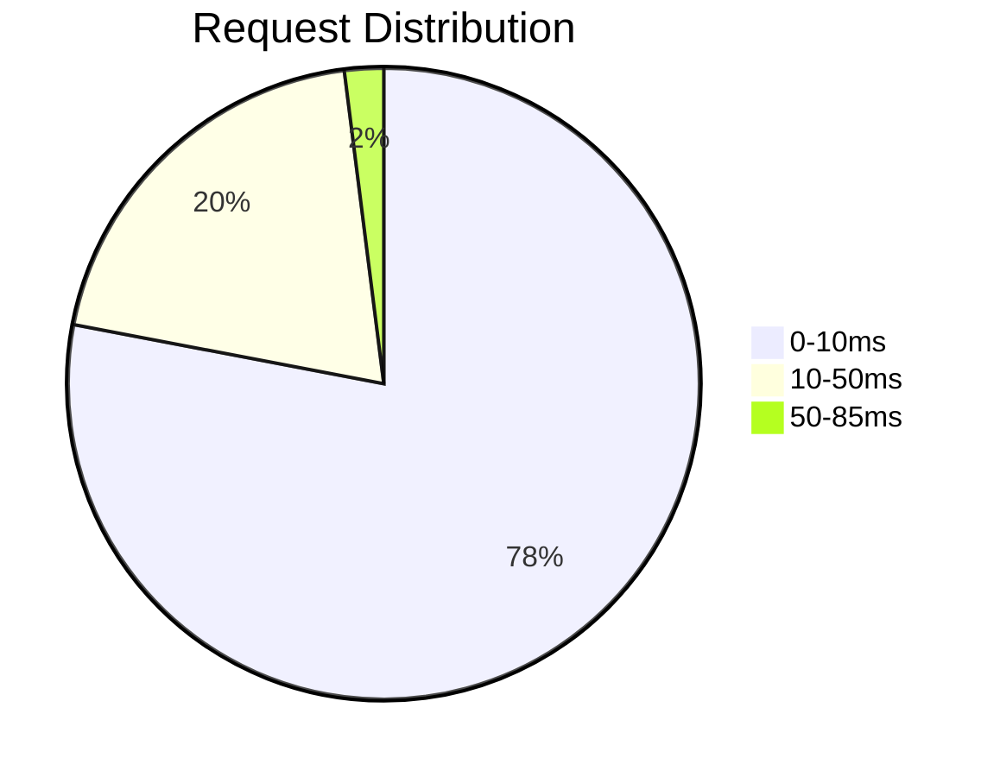
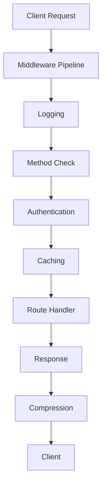

# 🚀 F# High-Performance HTTP Server

<div align="center">
  <a href="https://fsharp.org">
    
  </a>
</div>

A blazing-fast HTTP server built with F# using functional programming paradigms, featuring:

- 🚄 **ReaderT monad** for dependency management
- 🛤️ **Railway-oriented Programming** for error handling
- ⚡ **Asynchronous processing** with MailboxProcessor
- 🔒 **Thread-safe services** using agent-based architecture
- 🧩 **Middleware pipeline** (logging, auth, caching, compression)
- 📦 **Dependency Injection** container with lifecycle management
- 🔥 **High performance** (handles 1M requests in 25s!)

## ✨ Features

| Feature          | Description                                                                 |
|------------------|-----------------------------------------------------------------------------|
| 🚀 High Speed    | Processes 40k requests/second on average hardware                           |
| 🔒 Authentication| Token-based authentication with configurable whitelist                      |
| 📦 Response Cache| In-memory caching with TTL support                                          |
| 🔄 GZIP Support  | Automatic response compression                                             |
| 📊 Detailed Logging| Multi-level logging with request/response details                         |
| 🧪 Testable Design| Pure functions and explicit dependencies enable easy testing               |

## ⚙️ Installation & Usage

### Prerequisites
- .NET 6 SDK or newer
- F# 6.0

### Running the Server
```bash
git clone https://github.com/yourusername/fsharp-http-server.git
cd fsharp-http-server
dotnet run
```

### Sample Requests
```bash
# Public endpoint
curl http://localhost:8080/public

# Authenticated endpoint (use valid token)
curl -H "Authorization: token1" http://localhost:8080/hello?name=John

# Generate error
curl http://localhost:8080/error
```

## 🏎️ Performance Results

We tested the server with **1,000,000 requests** using 16 parallel connections:

| Metric           | Value             |
|------------------|-------------------|
| ⏱️ Total Time    | 24.99 seconds     |
| ✅ Successful    | 1,000,000         |
| ❌ Errors        | 0                 |
| 📉 Error Rate    | 0.00%             |
| ⏱️ Avg Time      | 0.40 ms           |
| ⏱️ Min Time      | 0.04 ms           |
| ⏱️ Max Time      | 85.04 ms          |



## 🧠 Architecture Highlights



### Key Components
1. **ReaderT Monad** - Manages dependencies and request context
2. **Railway-oriented Programming** - Error handling pipeline
3. **Agent-based Services** - Thread-safe counters and loggers
4. **Middleware Pipeline** - Composable request processing:
   - 📝 Logging
   - 🔐 Authentication
   - 🗳️ Method Validation
   - 📦 Response Caching
   - 🗜️ GZIP Compression

## 📜 License

This project is licensed under the MIT License - see the [LICENSE](LICENSE) file for details.

---

Made with ❤️ and F#. Contribute to make it even faster!